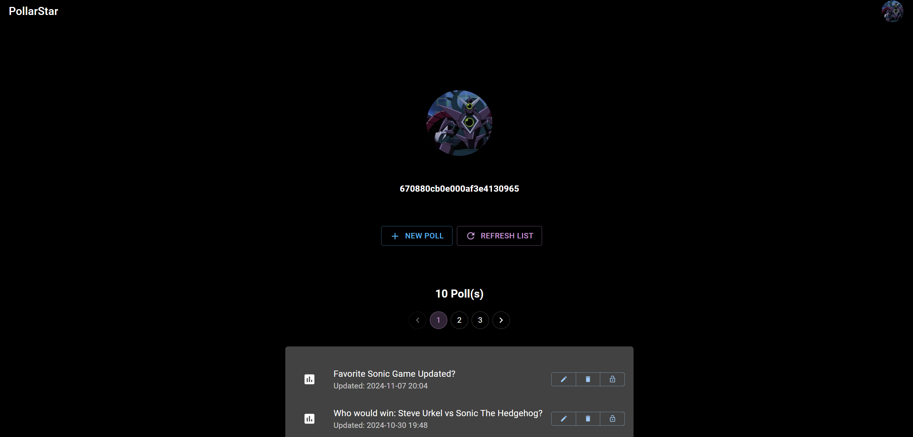
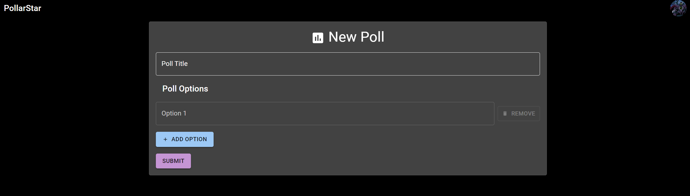
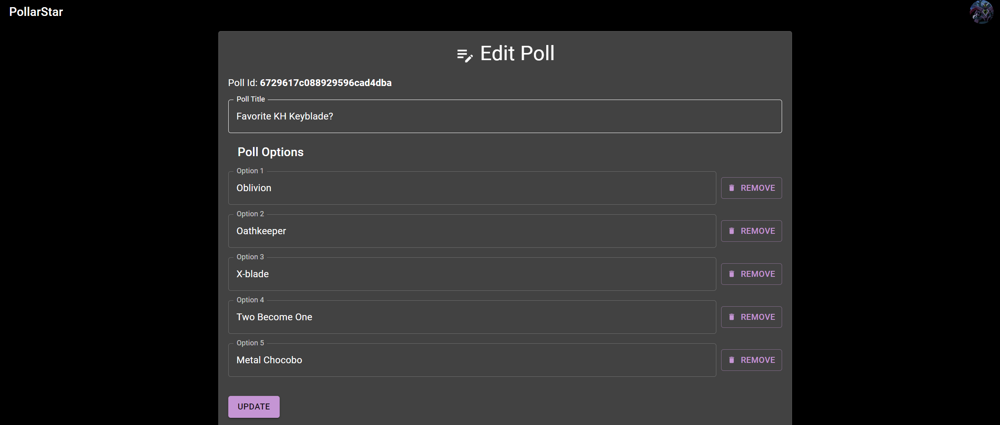
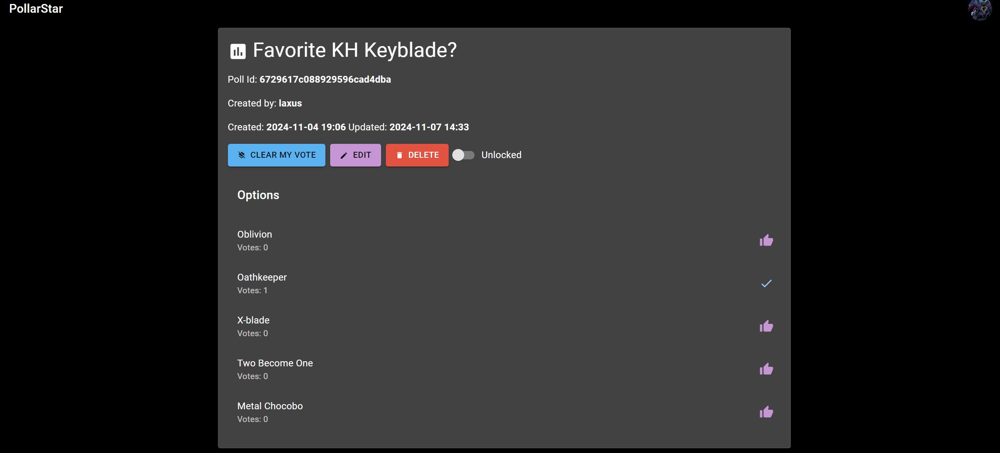

# PollarStar Demo: Create and share polls freely

This is PollarStar. A demo app I spent time developing to both
sharpen and showcase my skills as full-stack dev. It is a complete
full-stack application complete with both a front-end and back-end, all
built by me. The idea of this demo app is that you can create an account
and create polls. These polls can be shared freely via link. People can
view a poll and vote on it. I would say the inspiration for this app
for me was [StrawPoll](https://strawpoll.com/) in its earlier days.
I may make improvements to this project in the future but it's current state is
what I consider to be a full-functional proof of concept. Jump to [Screenshots](#screenshots-of-demo) for images of the demo running.

## Stack/Frameworks

I used the following tools/frameworks to build out this app.
This project not only helped me sharpen these skills further but
also proves my knowledge of them:

- Front-End: [Next.js](https://nextjs.org/) (React.js based framework)
- Global State Management: [Redux Toolkit](https://redux-toolkit.js.org/)
- [TypeScript](https://www.typescriptlang.org/): JavaScript with syntax for types.
- Back-End: [Node.js](https://nodejs.org/en) and [Express](https://expressjs.com/)
- Database (NoSQL): [MongoDB](https://www.mongodb.com/) and [Mongoose ODM](https://mongoosejs.com/)
- Security/Authentication: [JWT Token](https://www.npmjs.com/package/jsonwebtoken) and [bcrypt](https://www.npmjs.com/package/bcrypt)
- [Material UI](https://mui.com/material-ui/): Reusable React components that implement Google's material design.
- [Tailwind CSS](https://tailwindcss.com/): Utility-first CSS framework.

These are the most prominent libraries/frameworks I used. To see a comprehensive list of anything I didn't mention here, check the package.json files for the front and back ends respectively.

## Configuration

If you would like to get this running to either check it out, play around,
or even contribute then start by downloading the code via your preferred
method. (e.g. Downloading a zip from GitHub or `git clone`)

For example:

`git clone https://github.com/hoogmin/pollarstar`

Now you should have all the code. The project uses [dotenv](https://www.npmjs.com/package/dotenv) so you'll need to set some env variables for the backend:

`cd backend`

Once inside create a `.env` file with the following variables specified:

- `PORT`: Port back-end will bind to. Must be different than front-end.
- `MONGO_URI`: URI to your MongoDB cluster. I used [MongoDB Atlas](https://www.mongodb.com/products/platform/atlas-database) to host mine, but you can use anything.
- `JWT_ACCESS_SECRET`: Secret for signing access tokens. Make sure it is long and secure.
- `JWT_REFRESH_SECRET`: Secret for signing refresh tokens. Length and security are important here too.

Once all these values are set properly the back-end will run properly via `npm run dev` while in the `backend` directory.
The front-end can be run with a simple `npm run dev` provided you have
installed packages first via `npm install` while in the `frontend` directory.

I had a lot of fun developing this, so happy hacking if you check it out.

## License

This project is licensed under the [BSD-3-Clause](./LICENSE) license.
Please give it a read if you intend on using any code from this repo.
Thanks.

## Screenshots of Demo

Home:

New Poll Page:

Edit Poll Page:

View a poll:
